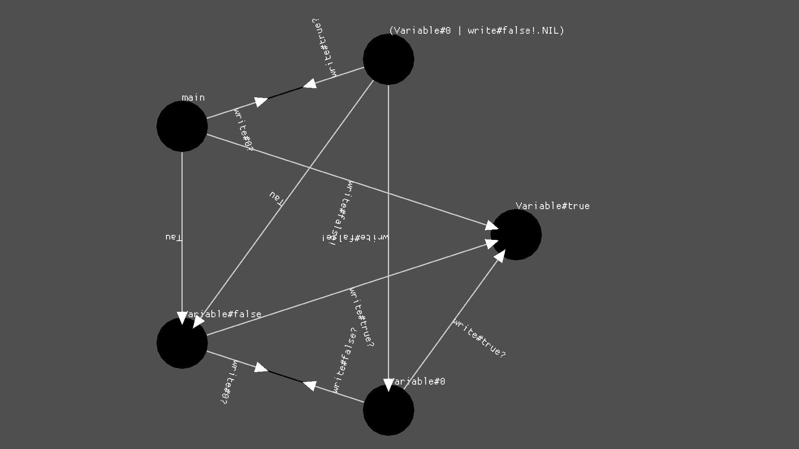

A library for the [CCS](https://en.wikipedia.org/wiki/Calculus_of_communicating_systems)/VP language


## Example

```rs
#![start(main)]
#![bounds(0..1000)]

type Id = int;
enum Channel { Send(int), Recv(int) }
enum Process { Nil, Either(Id, Id), Parallel(Id, Id) }

fn factorial(n) { factorial_rec(n, 1) }

fn factorial_rec(n, acc) {
    if (n == 0) {
        return!(acc)
    } else {
        factorial_rec((n - 1), (n * acc))
    }
}

fn main() { factorial(4) }
```

## Screenshot

